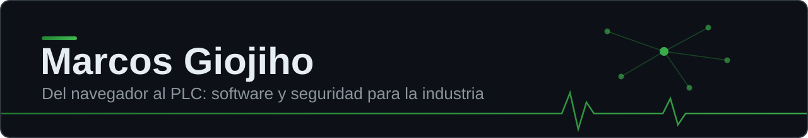

<a href="#english-version">English version</a>

## Sobre mí

Hago software de todo tipo: aplicaciones corporativas, sistemas de reservas, simuladores, apps móviles. Pero mi terreno favorito es la frontera entre dos mundos que casi nunca se hablan: la **planta industrial** y el **software moderno**.

Ahí mi trabajo es hacer que instalaciones reales, como plantas fotovoltaicas, se puedan controlar y supervisar desde un navegador o un móvil, y llevar esa experiencia al terreno de la seguridad y el cumplimiento. Saber lo que pasa dentro del PLC y también en el navegador es lo que define cómo diseño software.

En junio de 2026 terminé el Curso de Especialización de FP en Ciberseguridad (hacking ético, análisis forense, bastionado y respuesta a incidentes), y ahora estoy llevando esa base al terreno donde menos gente la aplica: las redes industriales.

## Proyecto destacado: Linceo

> **Descubrimiento y monitorización pasiva de redes OT: ver tu planta sin tocarla.**

Un sensor de red pasivo pensado para entornos industriales, donde escanear activamente puede tirar una línea de producción. Linceo escucha el tráfico, descubre los activos y dibuja el mapa de la red sin inyectar un solo paquete.

**En diseño y desarrollo activo**, con repositorio público próximamente. Es mi primer proyecto open source y el punto donde converge todo lo que sé de industria con todo lo que estoy aprendiendo de seguridad. Si quieres enterarte cuando se publique, sigue este perfil: el repositorio se anunciará aquí.

## Qué he construido

**Plataforma de telemetría industrial.** Un backend en Python lee PLCs Siemens y Delta por tres protocolos (Modbus, OPC UA y S7). Todo se configura desde un panel Laravel con login corporativo (Entra ID): se crean proyectos, se les asignan PLCs y se elige qué variables leer, sin tocar código. La visualización corre sobre Grafana, y es la propia plataforma quien lo aprovisiona: crea la organización de cada proyecto, conecta a sus usuarios y deja el origen de datos (MySQL o PostgreSQL, según la infraestructura de cada proyecto) listo para montar los gráficos sin configuración manual.

Cuando un PLC se marcha a una instalación piloto, viaja con un dispositivo de campo (una Raspberry Pi o un mini PC) que ejecuta un agente: lee en local, envía por WireGuard y, si se corta la conexión, retiene las lecturas en un buffer persistente hasta poder reenviarlas. Los agentes también se administran desde el panel central, cada uno con los PLCs y las variables que el operario decida.

**Más de un año en producción en plantas fotovoltaicas, en uso diario por los equipos de operación.**

**Control integral de una máquina industrial.** Aquí el software es la máquina: un mini PC gobierna toda la lógica de funcionamiento y el PLC queda relegado a leer las señales de campo. El aislamiento viene de la propia arquitectura: el mini PC tiene dos bocas de red, una hacia el PLC y otra hacia el exterior, de modo que el PLC nunca está expuesto a la red. Y por debajo, una capa de protección en hardware, independiente del software de control; si el control se cuelga o pierde la alimentación, un vigilante (hombre muerto) corta la corriente y deja la máquina en estado seguro.

A pie de máquina se opera desde el navegador, previa autenticación en la propia interfaz, conectándose al punto de acceso wifi que emite la máquina o a su IP local. La gestión de flota corre en un panel central en AWS: cada unidad es un peer de WireGuard, y el panel (Laravel tras un reverse proxy) envía las peticiones a la API de cada máquina por el túnel, autenticadas además con JWT.

**Seis meses en marcha en fase de piloto, con apps móviles (React Native) y versión web.**

Ambos están diseñados y construidos de punta a punta por mí, de la capa de campo al frontend. Fuera de la planta también construyo el software corriente de una empresa: gestión de eventos corporativos, reservas para visitas guiadas, un portal interno, control de personal para I+D o simuladores con algoritmos.

Y no me quedo en el código. Lo que construyo lo pongo yo en producción: virtualizo sobre Proxmox, despliego con Coolify, publico servicios internos por Cloudflare Tunnel y paso el código por SonarQube. También monto los equipos, administro el firewall y el switching de la red (OPNsense, UniFi) y, cuando algo deja de responder, soy quien persigue el fallo hasta dar con él. Los detalles que faltan, como el tipo de máquina o los nombres de las plantas, quedan fuera por confidencialidad.

## Stack tecnológico

**Industrial**

**Backend**

**Frontend y móvil**

**Infraestructura**

**Seguridad**

## Certificaciones y formación

| Título | Institución |
|--------|-------------|
| Curso de Especialización en Ciberseguridad (FP oficial, 720 h, 2026) | IES Venancio Blanco (Salamanca) |
| Técnico Superior en Desarrollo de Aplicaciones Web (DAW, 2025) | IES Venancio Blanco (Salamanca) |
| Técnico en Sistemas Microinformáticos y Redes (SMR, 2023) | IES Venancio Blanco (Salamanca) |
| Dirección y Gestión de la Ciberseguridad (2026) | Instituto Superior de Ciberseguridad |
| Experto en RGPD (2026) | Instituto Superior de Ciberseguridad |
| Implantación y Gestión de la ISO 27001:2022 (2026) | Instituto Superior de Ciberseguridad |

## Contacto

¿Trabajas con redes industriales, te interesa Linceo o tienes un proyecto entre la planta y el navegador? Escríbeme.

[dev@giojiho.es](mailto:dev@giojiho.es) · [LinkedIn](https://www.linkedin.com/in/marcosturrion/)

---

## English version

<b>Full profile in English (click to expand)</b>

 

I build all kinds of software: corporate applications, booking systems, simulators, mobile apps. But my favorite ground is the border between two worlds that rarely talk to each other: the **factory floor** and **modern software**.

There, my job is making real industrial facilities, like solar plants, controllable and observable from a browser or a phone, and bringing that experience into security and compliance work. Knowing what happens inside the PLC and in the browser is what shapes how I design software.

In June 2026 I completed Spain's official vocational Specialization Course in Cybersecurity (ethical hacking, digital forensics, system hardening and incident response), and I'm now taking that foundation to the field where fewest people apply it: industrial networks.

### Featured project: Linceo

> **Passive OT network discovery and monitoring: see your plant without touching it.**

A passive network sensor built for industrial environments, where active scanning can take down a production line. Linceo listens to traffic, discovers assets and maps the network without injecting a single packet.

**In active design and development**, with the public repository coming soon. It's my first open source project, and the point where everything I know about industry meets everything I'm learning about security. If you want to know when it goes public, follow this profile: the repository will be announced here.

### What I've built

**Industrial telemetry platform.** A Python backend reads Siemens and Delta PLCs over three protocols (Modbus, OPC UA and S7). Everything is configured from a Laravel panel behind corporate login (Entra ID): you create projects, assign PLCs to them and choose which variables to read, without touching code. Visualization runs on Grafana, provisioned by the platform itself: it creates each project's organization, connects its users and leaves the data source (MySQL or PostgreSQL, depending on each project's infrastructure) ready so charts can be built with no manual setup.

When a PLC leaves for a pilot site, it travels with a field device (a Raspberry Pi or a mini PC) running an agent: it reads locally, sends over WireGuard and, if the connection drops, holds pending readings in a persistent buffer until they can be resent. Agents are also managed from the central panel, each reading the PLCs and variables the operator chooses.

**Over a year in production at solar plants, used daily by operations teams.**

**End-to-end control of an industrial machine.** Here the software is the machine: a mini PC runs the entire operating logic, with the PLC relegated to reading field signals. Isolation comes from the architecture itself: the mini PC has two network ports, one facing the PLC and one facing the outside, so the PLC is never exposed to the network. Underneath sits a hardware protection layer, independent of the control software; if the control hangs or loses power, a dead man's switch trips and cuts the current, leaving the machine in a safe state.

On site, the machine is operated from a browser, after authenticating in the interface itself, by connecting to the machine's own WiFi access point or to its local IP. Fleet management runs on a central panel on AWS: each unit is a WireGuard peer, and the panel (Laravel behind a reverse proxy) sends API requests to each machine through the tunnel, additionally authenticated with JWT.

**Six months running as a pilot, with mobile apps (React Native) and a web version.**

Both were designed and built end-to-end by me, from the field layer to the frontend. Away from the plant I also build the everyday software of a company: corporate event management, bookings for guided tours, an internal portal, staff tracking for R&D, simulators driven by algorithms.

And I don't stop at the code. What I build, I put into production myself: I virtualize on Proxmox, deploy with Coolify, publish internal services through Cloudflare Tunnel and run the code through SonarQube. I also set up the machines, run the network's firewall and switching (OPNsense, UniFi) and, when something stops responding, I'm the one chasing the fault until it's found. The missing details, like the kind of machine or the names of the plants, stay out for confidentiality reasons.

### Certifications

Specialization Course in Cybersecurity (official Spanish vocational degree, 720 h, 2026), Higher Technician in Web Application Development (DAW, 2025), Microcomputer Systems and Networks Technician (SMR, 2023), Cybersecurity Management, GDPR Expert and ISO 27001:2022 Implementation & Management (2026).

